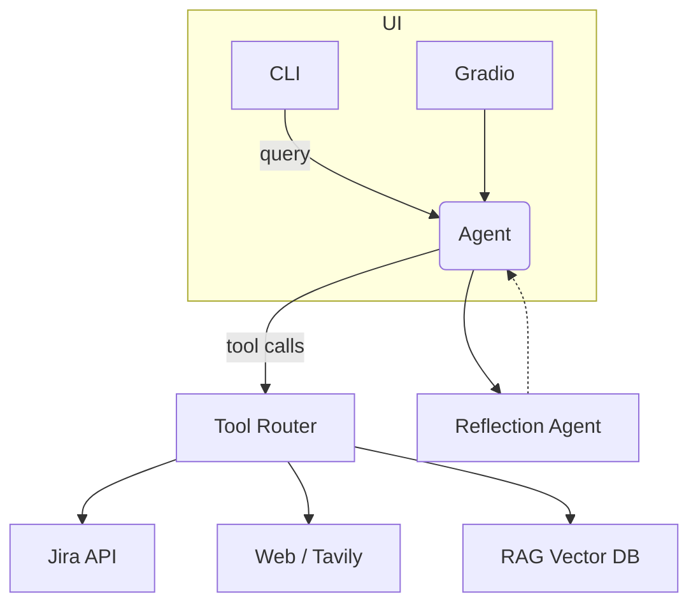

# 🧠 Universal AI Agent — Productoo P4 Assistant  
*Conversational copilot for product managers, analysts & engineers building the P4 manufacturing suite.*  
_Last update: 2025-07-02_

---

## ✨ Key Features

| Category | Status | Details |
|----------|--------|---------|
| Conversational interface | **✅** | CLI (`main.py`) & Gradio UI (`ui.py`). |
| Knowledge retrieval (RAG) | **✅** | Chroma vector-store auto-enriched with every Q/A turn. |
| Web / semantic search | **✅ / β** | DuckDuckGo & Wikipedia; Tavily search (optional). |
| Jira integration | **✅** | `jira_ideas_retriever` (list Ideas); **planned** `jira_issue_detail`, create/update. |
| File output | **✅** | `save_text_to_file` → `./output/YYYY-MM-DD_HHMM.txt`. |
| Confluence ingestion | **✅ (manual)** | `rag_confluence_loader.py` for bulk import. |

---

## 🧩 3-Tier Memory & Learning Architecture

```text
┌──────── Tier 0 ────────┐  User Prefs Store (language = cz-en, formality = 0.4 …)
└────────┬──────────────┘
         │
┌────────▼──────────────┐  Tier 1 — Episodic Memory  
│ ConversationSummary    │  • Rolling summary ~50 exchanges  
└────────┬──────────────┘
         │
┌────────▼──────────────┐  Tier 2 — Long-Term Semantic Memory (Chroma)  
│ Full chats, Jira, docs │  • Recency-boosted, similarity > 0.78  
└────────────────────────┘
```

1. **Retriever** → Tier 2 (recency-weighted)  
2. **Prompt builder** → Tier 1 summary + Tier 0 prefs  
3. **LLM call** (GPT-4o by default)  
4. **Reflection agent** (Llama 3 8B) checks coherence/citations; rerolls if nutné  
5. Exchange persists back to Tier 2; summary updates Tier 1

_Why it matters:_ agent remembers your decisions & tone, keeps context window small, a reflection pass snižuje halucinace.

---

## 🏗️ Architecture Overview



---

## 🚀 Quick Start

```bash
# 1 ) Dependencies
python -m venv .venv && source .venv/bin/activate
pip install -r requirements.txt

# 2 ) Secrets
cp .env.example .env  # fill in OPENAI_API_KEY, JIRA_AUTH_TOKEN, …

# 3 ) Run
python main.py            # CLI
# or
python ui.py              # Web UI http://127.0.0.1:7860
```

### Required ENV

```dotenv
OPENAI_API_KEY="sk-…"
JIRA_AUTH_TOKEN="atlassian-…"
TAVILY_API_KEY=""        # optional
```

---

## 📂 Project Layout

```
universalagent/
├── main.py                 # conversational loop
├── ui.py                   # Gradio front-end
├── tools.py                # LangChain Tools
├── core_memory.py          # 3-tier memory impl.  ← NEW
├── reflection_agent.py     # self-critique layer  ← NEW
├── jira_retriever.py       # low-level Jira REST
├── rag_*                   # RAG loaders & helpers
├── output/                 # exported answers
└── rag_chroma_db/          # vector DB (ignored)
```

---

## 🛣️ Roadmap 2025 H2

| Quadrant | Epic | KPI / Definition of Done |
|----------|------|--------------------------|
| **Reliability & Memory** | **Feedback-safe short-term memory** | Latency ≤ 2 s @ 2 k messages |
| | Reflection agent v1 | 20 % drop in hallucination score |
| **Tools & Integrations** | `jira_issue_detail` + create/update | Epic ↔ Stories auto-flow round-trip |
| | Confluence incremental sync | Nightly run, removed pages flagged `archived` |
| **Code Quality & CI** | Ruff + mypy gate | Coverage ≥ 80 % critical modules |
| | Docker + GH Actions | Push to GHCR on every tag |
| **LLM Backend** | Adapter layer (OpenAI / Anthropic / Ollama) | Swap model w/o touching business logic |
| | Fine-tune Llama 3 8B on PM transcripts | 5 % ↑ helpfulness in eval harness |

---

## 🎯 Immediate Priorities (next 2 weeks)

1. **Replace `ConversationBufferMemory` → `ConversationSummaryBufferMemory`**  
2. **Implement retriever wrapper** with recency decay  
3. **Add `user_prefs.json`** and inject into every prompt  
4. **Integrate reflection agent** (ReAct + Self-Critique)  
5. **CI smoke test** with 20 real PM queries & LLM-as-judge scoring

---

## 🧪 Evaluation Harness (CI)

* **Dataset:** `./eval/pm_queries.jsonl` (prompt, expected key-phrases)  
* **Metrics:** helpfulness, correctness, style, answer_tokens/context_tokens  
* **Gate:** PR blocked if score < 0.70

---

## 🤖 Switching Models

| Model | Reasoning | Latency (EU) | Cost / 1k tok | Context |
|-------|-----------|--------------|---------------|---------|
| GPT-4o | ★★★★★ | 1.0× | \$0.005 | 128 k |
| Claude 3 Opus | ★★★★☆ | 1.3× | \$0.009 | 200 k |
| Llama 3 70B (LoRA) | ★★★ | 0.5×* | \$0.0007 | 8 k |

\* assuming local GPU inference

_Default:_ GPT-4o for main reasoning, Llama 3 8B for reflection & embeddings.

---

## 🙌 Contributing / Ideas

Issues & PRs welcome – or ping **@tomas.ventruba** on Slack. Please run the eval harness before opening a PR.

---

© Productoo s.r.o. 2025 – internal use only.
